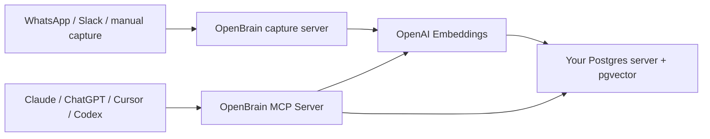

# OpenBrain

OpenBrain is a small, owned memory layer for AI tools and agents. It stores thoughts in Postgres, embeds them for semantic search, and exposes them through MCP so multiple AI clients can use the same memory.

> **Deployment note:** the running setup uses a dedicated `openbrain` database +
> role and serves MCP through an **n8n** MCP Server Trigger rather than the
> TypeScript `mcp-server` in `src/`. See
> [`docs/deployment-live.md`](docs/deployment-live.md). The `src/` app remains the
> original reference implementation.

## What This Includes

- Plain Postgres schema with `pgvector`.
- Node capture endpoint for JSON, raw text, Slack slash commands, or WhatsApp Cloud API webhooks.
- TypeScript MCP server with search, recent entries, stats, and capture tools.
- Lifecycle prompts for migration, capture habits, and weekly review.

## Build Order

1. Install Postgres with the `pgvector` extension on your server.
2. Create an `openbrain` database and run `db/migrations/0001_openbrain.sql`.
3. Set secrets from `.env.example`.
4. Install/build the app with `npm install` and `npm run build`.
5. Run the capture server with `npm run capture`.
6. Add the MCP server to Claude, Cursor, Codex, or another MCP-capable client.

Full instructions are in `docs/setup.md`. A sample Kubernetes deployment of a
standalone Postgres + pgvector is in `db/k3s/`.

## Architecture

## Notes

This starter favors clear infrastructure over clever automation. Metadata extraction is intentionally lightweight at first; semantic search does the heavy lifting. Once capture is working, the next useful upgrade is an optional classifier step that extracts richer people, projects, decisions, and action items.
