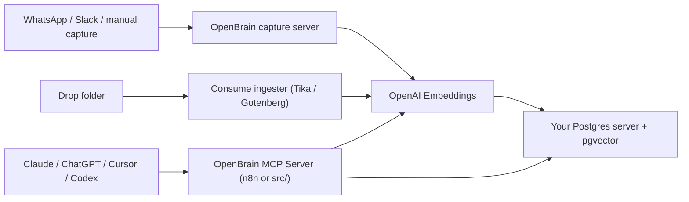

# OpenBrain

OpenBrain is a small, owned memory layer for AI tools and agents. It stores thoughts in Postgres, embeds them for semantic search, and exposes them through MCP so multiple AI clients can use the same memory.

> **Deployment note:** the running setup uses a dedicated `openbrain` database +
> role and serves MCP through **n8n** MCP Server Trigger workflows (exported in
> [`n8n/`](n8n/)) rather than the TypeScript `mcp-server` in `src/`. See
> [`docs/deployment-live.md`](docs/deployment-live.md). The `src/` app remains the
> original reference implementation.

## What This Includes

- Plain Postgres schema with `pgvector`, applied by a small versioned migration runner (`db/`).
- Hybrid search: vector similarity and Postgres full-text search fused with reciprocal rank fusion, so exact terms (names, IDs, error strings) that embeddings miss still surface.
- Supersession: a retired memory is marked with a pointer to its replacement instead of being deleted, and retrieval hides it by default.
- Retrieval telemetry and explicit usefulness feedback (`rsi/`), so you can see which searches came back empty, errored, or were rated not useful.
- Node capture endpoint for JSON, raw text, Slack slash commands, or WhatsApp Cloud API webhooks.
- TypeScript MCP server with search, recent entries, stats, and capture tools.
- n8n workflow exports for the MCP endpoint, search/capture sub-workflows, and a second read-only consumer endpoint (`n8n/`).
- Consume-folder ingester (`ingester/`): drop any document (PDF, Office, images, …) into a
  watched folder and it's text-extracted (with OCR), chunked, embedded, and stored. Uses
  Apache Tika + Gotenberg for extraction; failures are recorded and can be emailed as a
  digest. Kubernetes manifests in `k8s/`.
- Lifecycle prompts for migration, capture habits, and weekly review.

## Layout

| Path | Contents |
| --- | --- |
| `db/migrations/` | Schema, applied in order by `db/migrate.py` (see [`db/README.md`](db/README.md)) |
| `db/k3s/` | Sample standalone Postgres + pgvector StatefulSet |
| `src/` | Reference capture server + MCP server (TypeScript) |
| `n8n/` | MCP Server Trigger and sub-workflow exports |
| `ingester/` | Consume-folder ingester, failure-alert workflow and tests |
| `k8s/` | Ingester, Tika, Gotenberg, and drop-folder PV/PVC manifests |
| `rsi/` | Retrieval-feedback reporting query and tests |
| `docs/` | Setup guide and the n8n deployment pattern |

## Build Order

1. Install Postgres with the `pgvector` extension on your server.
2. Create an `openbrain` database and apply every migration with `python db/migrate.py`.
3. Set secrets from `.env.example`.
4. Install/build the app with `npm install` and `npm run build`.
5. Run the capture server with `npm run capture`.
6. Add the MCP server to Claude, Cursor, Codex, or another MCP-capable client.

Full instructions are in `docs/setup.md`.

## Architecture

```mermaid
flowchart LR
  CaptureSource["WhatsApp / Slack / manual capture"] --> Capture["OpenBrain capture server"]
  Drop["Drop folder"] --> Ingester["Consume ingester (Tika / Gotenberg)"]
  Capture --> OpenAI["OpenAI Embeddings"]
  Ingester --> OpenAI
  OpenAI --> Postgres["Your Postgres server + pgvector"]
  MCP["OpenBrain MCP Server (n8n or src/)"] --> OpenAI
  MCP --> Postgres
  AI["Claude / ChatGPT / Cursor / Codex"] --> MCP
```

## Notes

This starter favors clear infrastructure over clever automation. Metadata extraction is intentionally lightweight at first; semantic search does the heavy lifting. Once capture is working, the next useful upgrade is an optional classifier step that extracts richer people, projects, decisions, and action items.
